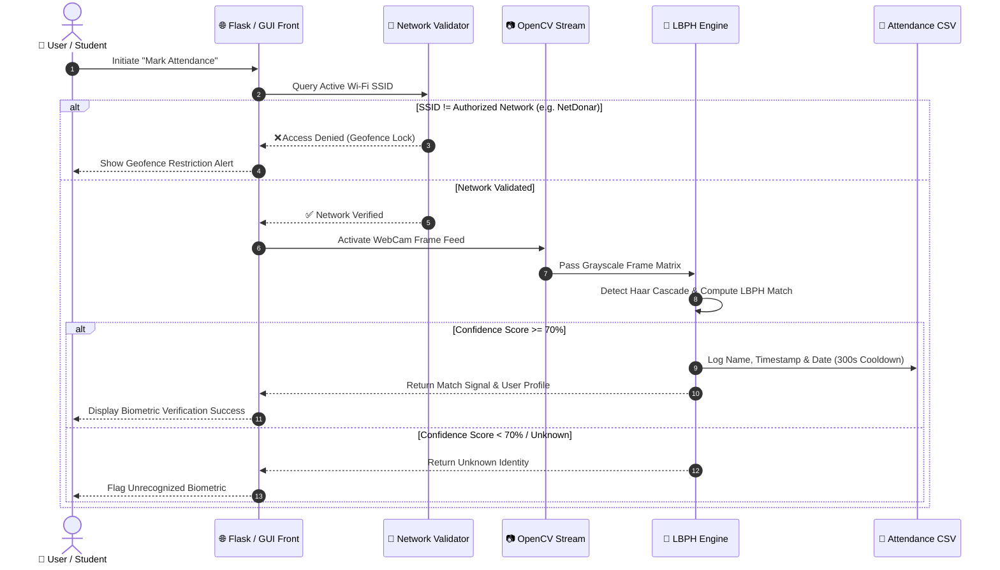

<div align="center">

  <!-- Logo & Title -->
  <a href="https://github.com/your-username/FacePulse">
    
  </a>

  <h1 align="center">💠 FacePulse</h1>
  <h3 align="center">Next-Generation Biometric Intelligence & Geofenced Attendance Ecosystem</h3>

  <p align="center">
    <strong>Automated Real-Time Presence Verification powered by OpenCV LBPH Neural Engine & Network-Aware Geofencing</strong>
  </p>

  <!-- Dynamic Typing Animation Banner -->
  <p align="center">
    <a href="https://github.com/readme-typing-svg">
      
    </a>
  </p>

  <!-- Shields & Badges Grid -->
  <p align="center">
    <a href="#-tech-stack"></a>
    <a href="#-tech-stack"></a>
    <a href="#-tech-stack"></a>
    <a href="#-tech-stack"></a>
    <a href="LICENSE"></a>
  </p>

  <p align="center">
    <a href="#-product-overview">Overview</a> •
    <a href="#-key-features">Key Features</a> •
    <a href="#-system-architecture">Architecture</a> •
    <a href="#-tech-stack">Tech Stack</a> •
    <a href="#-installation--quickstart">Quickstart</a> •
    <a href="#-project-architecture">Structure</a>
  </p>

  
</div>

<br/>

## 🎯 Product Overview

> [!IMPORTANT]
> **FacePulse** bridges computer vision biometrics with network-layer location assurance. Designed for modern corporate and academic environments, it replaces error-prone manual logs and static QR codes with a zero-friction, anti-proxy presence tracking engine.

<table>
  <tr>
    <td width="50%" valign="top">
      <h3>🔐 Neural Biometric Core</h3>
      <p>Utilizes <strong>Local Binary Patterns Histograms (LBPH)</strong> with 50-frame per-user facial identity sampling. Evaluates frame vectors at a strict <strong>70% confidence threshold</strong> to instantly eliminate proxy attempts while delivering sub-second matching.</p>
    </td>
    <td width="50%" valign="top">
      <h3>🌐 Hardware Network Geofencing</h3>
      <p>Implements native OS-level interface querying (<code>netsh wlan</code> integration) to restrict attendance authorization exclusively to verified organization Wi-Fi SSIDs (e.g. <code>NetDonar</code>), enforcing physical presence integrity.</p>
    </td>
  </tr>
  <tr>
    <td width="50%" valign="top">
      <h3>💻 Dual-Platform Portal</h3>
      <p>Features both a sleek <strong>Flask Glassmorphism 2.0 Web Application</strong> with dynamic Chart.js dashboards and a high-performance <strong>Tkinter Desktop Client</strong> with real-time dark/light theme switching and embedded Matplotlib telemetry.</p>
    </td>
    <td width="50%" valign="top">
      <h3>📈 Presence Intelligence</h3>
      <p>Automates daily and weekly attendance compilation into structured Pandas datasets with gamified engagement tracking (streaks, punctuality metrics) and anti-spam 300-second verification cooldowns.</p>
    </td>
  </tr>
</table>

<br/>

## ⚡ Key Features

| Capability | Engine / Feature | Description | Status |
| :--- | :--- | :--- | :---: |
| **Biometric Match** | `OpenCV LBPH` | Real-time face detection & 0.2s identity classification | `ACTIVE` |
| **Identity Training** | `50-Frame Mapping` | Automated multi-angle dataset collection & model synthesis | `ACTIVE` |
| **Geofence Lock** | `SSID Validation` | Native Wi-Fi network inspection to prevent remote spoofing | `ACTIVE` |
| **Web Portal** | `Flask + Glassmorphism` | Interactive scan popups, active status badges & student timeline | `ACTIVE` |
| **Desktop Suite** | `Tkinter + Matplotlib` | Native GUI client with dark/light themes & integrated graphs | `ACTIVE` |
| **Analytics Engine** | `Pandas + Chart.js` | Heatmaps, daily presence CSV generation & weekly summaries | `ACTIVE` |

<br/>

## 🏗️ System Architecture



<br/>

## 🛠️ Tech Stack

<div align="center">

| Domain | Technologies & Frameworks |
| :--- | :--- |
| **Core AI & Vision** |    |
| **Backend & APIs** |    |
| **Frontend Web** |    |
| **Desktop App** |   |
| **UI Libraries** |    |

</div>

<br/>

## 📊 Performance & Security Benchmarks

> [!NOTE]
> Engineered to run efficiently on standard workstation hardware without requiring specialized TPU/GPU accelerators.

- **Neural Detection Latency**: `~200ms per frame`
- **Biometric Enrollment Matrix**: `50 normalized facial keyframes per user`
- **Verification Confidence Threshold**: `70% matching threshold (100 - distance)`
- **Network Verification Overhead**: `< 15ms local SSID inspection`
- **Attendance Record Cooldown**: `300 seconds (prevents duplicate logs)`

<br/>

## 🚀 Installation & Quickstart

### Prerequisites

- Python **3.9** or higher
- System webcam / integrated camera
- OpenCV dependencies (`opencv-contrib-python`)

### 1️⃣ Clone & Setup Environment

```bash
# Clone the repository
git clone https://github.com/your-username/FacePulse.git
cd FacePulse

# Create and activate virtual environment
python -m venv venv
# On Windows:
venv\Scripts\activate
# On Linux/macOS:
source venv/bin/activate
```

### 2️⃣ Install Dependencies

```bash
pip install -r requriments.txt
```

> [!TIP]
> Ensure `haarcascade_frontalface_default.xml` is located in the root directory before running the system.

### 3️⃣ Train Biometric Model & Launch

#### Option A: Launch Web Portal (Flask)
```bash
python app.py
```
*Access the interactive portal at `http://127.0.0.1:5000`*

#### Option B: Launch Desktop Application (Tkinter GUI)
```bash
python gui.py
```

<br/>

## 📂 Project Architecture

```
FacePulse/
├── 📄 app.py                  # Main Flask server, streaming endpoint & geofence routing
├── 📄 gui.py                  # Tkinter Desktop application with dark/light themes & charts
├── 📄 collect_faces.py        # OpenCV biometric face sample collector engine
├── 📄 collect_faces_script.py # Automated identity capture script (50 frames)
├── 📄 train_model.py          # LBPH model trainer & weights compiler
├── 📄 recognize_attendance.py # Standalone attendance recognition pipeline
├── 📄 daily_report.py         # Daily presence log summary generator
├── 📄 weekly_report.py        # Weekly attendance metrics & analytics generator
├── 📄 test_camera.py          # Optical camera diagnostic utility
├── 📁 attendance/             # Auto-generated daily CSV presence logs
├── 📁 dataset/                # Biometric identity image nodes per user
├── 📁 trainer/                # Compiled face recognition weights (face_trainer.yml)
├── 📁 static/                 # Web assets (Glassmorphism CSS, JS, logo images)
├── 📁 templates/              # HTML5 application views (about, login, dashboard)
└── 📄 haarcascade_frontalface_default.xml # Haar Cascade face detector classifier
```

<br/>

## 🔄 User Workflow

```
[ 1. User Enrollment ] ────► Captures 50 face samples via OpenCV camera engine
                                           │
                                           ▼
[ 2. Neural Training ] ────► Compiles dataset into trainer/face_trainer.yml
                                           │
                                           ▼
[ 3. Network Check  ] ────► Verifies active SSID against authorized Wi-Fi list
                                           │
                                           ▼
[ 4. Presence Scan  ] ────► 0.2s LBPH face recognition matching (>=70% score)
                                           │
                                           ▼
[ 5. Log & Analytics] ────► Appends entry to CSV log + updates dynamic dashboards
```

<br/>

## ⚖️ License & Acknowledgements

This project is licensed under the **MIT License**.

<div align="center">
  <br/>
  <p><strong>FacePulse — Designed for the Future of Secure Biometric Automation</strong></p>

  <a href="#-facepulse"></a>
  <br/><br/>
</div>
